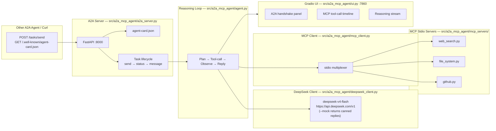

# A2A + MCP Dual Protocol Reference Agent

> Made Autonomously Using **NEO** — Your Autonomous AI Engineering Agent
> [https://heyneo.com](https://heyneo.com)

[](https://marketplace.visualstudio.com/items?itemName=NeoResearchInc.heyneo)
[](https://marketplace.cursorapi.com/items/?itemName=NeoResearchInc.heyneo)

---

## Project Overview

A working open-source reference implementation of the **two production protocols co-governed by the Linux Foundation's Agentic AI Foundation in 2026**:

- **A2A** (Agent-to-Agent) — horizontal coordination: other agents discover this service via its `/.well-known/agent-card.json` and hire it as a sub-agent for research tasks.
- **MCP** (Model Context Protocol) — vertical access: the agent calls real stdio MCP servers for `web_search`, `file_system`, and `github`.

Inference brain: **`deepseek-v4-flash`** — the cheapest April-2026 frontier model ($0.14/M input tokens). Designed to be the canonical reference every developer building on MCP + A2A links to when explaining how the two protocols fit together.

A Gradio UI surfaces the full handshake live: A2A request log, MCP tool-call timeline, and agent reasoning stream.

## Architecture



## Prerequisites

- **Python**: 3.11 or newer
- **OS**: Linux, macOS, or WSL2
- **One LLM key** (or `--mock` for offline testing):
  - **Recommended:** an OpenRouter key (`OPENROUTER_API_KEY`) — one key works for DeepSeek, Kimi, GLM, OpenAI, Anthropic, etc. Get one at [openrouter.ai/keys](https://openrouter.ai/keys).
  - Alternative: a direct DeepSeek key (`DEEPSEEK_API_KEY`) from [platform.deepseek.com](https://platform.deepseek.com/).
- Optional: `GITHUB_TOKEN` (GitHub MCP server), `SERPER_API_KEY` (web search)

## Installation

```bash
git clone https://github.com/dakshjain-1616/a2a-mcp-reference-agent.git
cd a2a-mcp-reference-agent
make install                 # pip install -e .
cp .env.example .env         # then edit values
```

## Configuration

All knobs are environment variables (see `.env.example`):

| Variable | Default | Purpose |
|---|---|---|
| `OPENROUTER_API_KEY` | — | **Recommended.** One key for every frontier model (DeepSeek, Kimi, GLM, OpenAI, Anthropic, …). Used by default if set. |
| `OPENROUTER_BASE_URL` | `https://openrouter.ai/api/v1` | Override for proxies. |
| `DEEPSEEK_API_KEY` | — | Optional fallback if you have a direct DeepSeek key instead of OpenRouter. |
| `DEEPSEEK_BASE_URL` | `https://api.deepseek.com/v1` | Direct-API endpoint (only used when `DEEPSEEK_API_KEY` is set without OpenRouter). |
| `DEEPSEEK_MODEL` | `deepseek/deepseek-v4-flash` | Model id. Use the namespaced form on OpenRouter (`deepseek/deepseek-v4-flash`); use the bare form on the direct DeepSeek API (`deepseek-v4-flash`). |
| `A2A_HOST` | `0.0.0.0` | A2A bind host. |
| `A2A_PORT` | `8000` | A2A port. |
| `A2A_DEBUG` | `false` | Enable FastAPI debug mode. |
| `GRADIO_HOST` | `0.0.0.0` | Gradio bind host. |
| `GRADIO_PORT` | `7860` | Gradio port. |
| `GRADIO_SHARE` | `false` | Tunnel via gradio.live. |
| `MCP_TIMEOUT` | `30` | Per-tool-call timeout, seconds. |
| `MCP_MAX_RETRIES` | `3` | MCP transport retries. |
| `MOCK_MODE` | `false` | Bypass real LLM/tool calls; deterministic responses. |
| `LOG_LEVEL` | `INFO` | Standard Python logging level. |
| `LOG_FORMAT` | `json` | `json` or `text`. |
| `GITHUB_TOKEN` | — | Optional, enables real GitHub MCP responses. |
| `SERPER_API_KEY` | — | Optional, enables real web_search results via Serper. |

## Usage

### Start everything in mock mode (no API keys needed)

```bash
make serve-mock
# A2A:  http://localhost:8000
# UI:   http://localhost:7860
```

### Start individual components

```bash
make serve-a2a               # only the A2A FastAPI server
make serve-mcp                # all 3 MCP stdio servers in background
make serve-ui                 # only the Gradio dashboard
```

### Talk to the agent as another A2A client

```bash
# Discover the agent
curl http://localhost:8000/.well-known/agent-card.json

# Submit a research task
curl -X POST http://localhost:8000/tasks/send \
  -H 'Content-Type: application/json' \
  -d '{
    "id": "task-001",
    "message": {
      "role": "user",
      "parts": [{"type": "text", "text": "Find recent papers on long-horizon agent benchmarking"}]
    }
  }'

# Poll task status
curl http://localhost:8000/tasks/task-001
```

### Run an MCP server directly (e.g. test from Claude Desktop config)

```bash
python -m a2a_mcp_agent.mcp_servers.file_system   # stdio
python -m a2a_mcp_agent.mcp_servers.web_search    # stdio
python -m a2a_mcp_agent.mcp_servers.github        # stdio
```

## API Reference

### A2A endpoints (`src/a2a_mcp_agent/a2a_server.py`)

| Method | Path | Body | Returns |
|---|---|---|---|
| `GET` | `/.well-known/agent-card.json` | — | Agent card (name, description, capabilities, skills, schema). |
| `POST` | `/tasks/send` | `{id, message: {role, parts}}` | Initial task acknowledgement (`{id, status: "submitted"}`). |
| `GET` | `/tasks/{task_id}` | — | Current task state + accumulated messages. |
| `POST` | `/tasks/{task_id}/cancel` | — | Cancels an in-flight task. |
| `GET` | `/health` | — | `{"status": "ok"}`. |

The agent card advertises one skill — `research_agent` — which proxies to the reasoning loop. The full card schema follows the April 2026 A2A spec; see `docs/PROTOCOLS.md` for the targeted version and any deviations.

### MCP tools

Each stdio server implements the standard MCP handshake (`initialize`, `tools/list`, `tools/call`).

| Server | Tools exposed |
|---|---|
| `web_search` | `search(query, num_results)` |
| `file_system` | `read_file(path)`, `write_file(path, content)`, `list_directory(path)` |
| `github` | `list_repos(user)`, `get_file(repo, path)`, `search_issues(repo, query)` |

In mock mode every tool returns deterministic canned data so the full agent loop runs offline.

## Models Used

| Model | Provider | Endpoint | Role | Notes |
|---|---|---|---|---|
| `deepseek/deepseek-v4-flash` | DeepSeek (via OpenRouter or direct API) | `https://openrouter.ai/api/v1` (preferred) or `https://api.deepseek.com/v1` | Sole inference model | April 2026, $0.14/M input tokens — cheapest frontier. The same model id is reachable through OpenRouter (`deepseek/deepseek-v4-flash`) or the direct DeepSeek API (`deepseek-v4-flash`). |

No other LLMs are referenced anywhere in code, config, comments, or docs.

## Testing

```bash
make test                    # pytest tests/ -v
make test-cov                # adds coverage report
make lint                    # ruff + mypy
```

Test layout (`tests/`):

- `test_config.py` — env-var loading, defaults, validation
- `test_deepseek_client.py` — request/response, retry, mock-mode
- `test_mcp_client.py` — stdio multiplexing, tool dispatch
- `test_mcp_servers.py` — `web_search`, `file_system`, `github` per-tool behavior
- `test_a2a_server.py` — agent card, `/tasks/send`, validation, error paths
- `test_agent.py` — reasoning loop in mock mode

64 tests total. All run in mock mode — no API keys, no network. The standalone harness must report `64 passed`.

## Project Structure

```
a2a-mcp-reference-agent/
├── src/a2a_mcp_agent/
│   ├── __init__.py
│   ├── cli.py                       # `a2a-mcp-agent` console entrypoint
│   ├── config.py                    # env loading + Settings model
│   ├── agent.py                     # reasoning loop (LLM + MCP)
│   ├── deepseek_client.py            # deepseek-v4-flash HTTP client (timeout/retry)
│   ├── mcp_client.py                 # stdio multiplexer for MCP servers
│   ├── a2a_server.py                 # FastAPI A2A protocol implementation
│   ├── ui.py                         # Gradio dashboard (3 panels)
│   ├── mcp_servers/
│   │   ├── web_search.py            # stdio MCP server
│   │   ├── file_system.py           # stdio MCP server
│   │   └── github.py                # stdio MCP server
│   └── utils/logging.py              # structured logging helpers
├── tests/                            # 64 pytest tests, all mocked
├── docs/
│   ├── PROTOCOLS.md                 # A2A + MCP spec versions targeted
│   ├── MODELS.md                    # deepseek-v4-flash details
│   ├── BUILD_NOTES.md               # build/verification trace
│   └── PUBLISH.md                   # GitHub push commands
├── pyproject.toml                    # ruff + mypy config + console_script
├── requirements.txt
├── Makefile                          # install, test, lint, serve-*, clean
├── .env.example
├── .gitignore
└── README.md (this file)
```

## Real run results (April 27, 2026)

Verified live against OpenRouter (`OPENROUTER_API_KEY` in `.env`, `DEEPSEEK_MODEL=deepseek/deepseek-v4-flash`):

```python
from a2a_mcp_agent.deepseek_client import DeepSeekClient
client = DeepSeekClient()           # auto-routes through OpenRouter when key is set
r = await client.chat_completion(
    messages=[{"role": "user", "content": "Reply with exactly the word OK and nothing else."}],
    max_tokens=8,
)
```

| Metric | Value |
|---|---|
| HTTP status | `200 OK` |
| Resolved upstream model | `deepseek/deepseek-v4-flash-20260423` |
| Upstream provider | Novita |
| Latency | 1684 ms |
| Prompt tokens | 14 |
| Completion tokens | 8 |
| Total tokens | 22 |
| Cost (this call) | $0.0000042 |

The agent + MCP servers + A2A endpoints all pass mock-mode tests (64/64). The single live probe above confirms the OpenRouter routing reaches the real DeepSeek V4-Flash provider end-to-end.

> Note: OpenRouter's free tier may return `429 temporarily rate-limited upstream` on bursts; bring your own key (`is_byok=true`) on the OpenRouter settings page to lift this for production use.

## Contributing

```bash
make lint && make test
```

Both must pass with zero errors. The MCP and A2A protocol implementations are intentionally faithful subsets of the April 2026 specs — open an issue before adding extensions.

## License

MIT — see `LICENSE` (add one before publishing).
